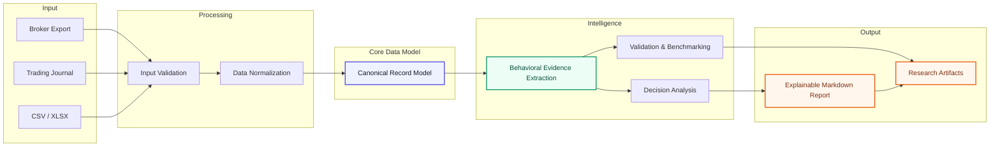

# Decision Learning Engine

Decision Learning Engine (DLE) is an evidence-driven behavioral analysis system
that transforms trading journals and broker exports into structured,
decision-quality insights.

[](https://www.python.org/)
[](LICENSE)
[]()
[](https://github.com/Adithya1912/DecisionLearningEngine/actions/workflows/ci.yml)

Rather than measuring only outcomes such as profit and loss, DLE focuses on how
decisions are made. It normalizes raw trading data into a canonical model,
performs modular analysis over that representation, and produces explainable,
validation-backed reports.

The project is structured as a layered research platform with clear separation
between ingestion, normalization, analysis, validation, and report generation.

---

## Table of Contents

- [Architecture](#architecture)
- [Why DLE is different](#why-dle-is-different)
- [Features](#features)
- [Usage](#usage)
- [Repository Structure](#repository-structure)
- [Status](#status)

---

## Architecture



 DLE follows an evidence-first architecture: raw trading data is normalized into canonical records before behavioral evidence is extracted and transformed into explainable insights.


### 1. Input layer

DLE accepts broker exports and trading-history files in common CSV/XLSX formats.
The goal is to work with real-world input, not idealized data. Different brokers
and journals often use different field names, layouts, and conventions, so the
first responsibility of the system is to make the data usable without assuming
it is already clean.

### 2. Normalization layer

The normalization layer maps source-specific fields into a canonical internal
representation. Date/time fields, instrument identifiers, side/action values,
quantities, prices, fees, and notes are translated into a stable record format
that the rest of the system can reason over consistently.

This is one of the core engineering strengths of the project: once data is in a
canonical form, downstream analysis becomes reproducible across different input
sources.

### 3. Canonical record layer

Canonical records are the internal language of DLE. They create a predictable
data model that is easier to validate, easier to compare across datasets, and
easier to extend as the project grows.

This layer is what lets the project behave like a system rather than a
collection of ad hoc scripts.

### 4. Behavioral evidence extraction

The behavioral evidence layer converts canonical records into signals that are
useful for decision-quality analysis. The emphasis is not just on outcome
summaries, but on behavioral interpretation: what kinds of decisions are being
made, how those decisions cluster, and where the process can improve.

### 5. Decision analysis

The analysis layer operates on extracted evidence to produce explainable,
decision-oriented insights. This is where the system moves beyond basic
performance summaries and into structured reasoning about the trading process.

### 6. Validation and benchmarking layer

DLE includes validation and benchmark-oriented workflows so that outputs can be
checked against known datasets, synthetic cases, and research scenarios. This
keeps the project grounded in measurable behavior instead of unverified claims.

### 7. Report generation layer

The final stage formats results into a readable Markdown report. The output is
intended to be transparent and explainable, so the reasoning path can be
reviewed rather than treated as a black box.

---

## Why DLE is different

Most trading journal tools emphasize performance summaries:

- total P&L
- win rate
- average trade size
- simple statistics

DLE is different because it is designed around decision-quality analysis.

### Canonical records first

Raw broker exports are noisy and inconsistent. DLE first converts them into a
canonical internal model so the rest of the pipeline operates on stable data.
That makes the analysis reproducible across different sources and easier to
validate over time.

### Validation is part of the product

Input validation is not an afterthought. The system checks required fields,
handles missing or partial rows safely, and returns clear messages when the
input is insufficient. A report is only useful if the pipeline can trust what
went into it.

### Analysis is separated from reporting

The analysis layer is distinct from the report generation layer. That separation
lets the reasoning logic evolve without breaking presentation, and it supports
clearer testing and maintenance.

### Built for research and iteration

The repository contains validation artifacts, benchmarking materials, and
supporting research outputs. That makes the project more than a one-off journal
processor. It is a working engineering base for testing ideas, comparing
behaviors, and improving the decision model over time.

### Modular by design

The codebase is split into functional areas so ingestion, analysis,
benchmarking, validation, and reporting can evolve independently. That modular
shape makes it easier to extend the system without turning the project into a
single fragile script.

---

## Features

- Evidence-based reporting for trading journals
- Explainable behavioral insights rather than only outcome summaries
- Modular Python system design
- Validation-first input handling
- Canonical modeling for inconsistent source formats
- Research-friendly benchmarking and validation workflows

---

## Usage

```powershell
python run_dle.py --input path\to\trades.csv --output validation\results\my_report.md
```

Typical required fields include:

- `date`, `time`, or `timestamp`
- `symbol` or `ticker`
- `side` or `action` with `BUY` / `SELL`
- `quantity`, `shares`, or `size`
- `price` or `value`

Useful optional fields include:

- `realized pnl`, `pnl`, or `profit/loss`
- `fees`, `charges`, or `commission`
- `notes`

If the input file is missing required structure, DLE returns a plain-language
error that explains what is missing rather than generating a misleading report.

---

## Repository Structure

```text
DLE/
|-- core/               # Core validation, analysis, and learning logic
|-- importers/          # Source-specific import and normalization code
|-- validation/         # Validation workflows, datasets, and reports
|-- research/           # Research orchestration and supporting experiments
|-- benchmarks/         # Benchmarking and comparison assets
|-- docs/               # Design notes, architecture, and supporting docs
|-- reports/            # Generated reports and output artifacts
|-- demo/               # Demonstrations and example outputs
|-- tests/              # Automated tests
`-- run_dle.py          # Entry point for self-serve report generation
```

---

## Status

This repository is the public-facing research version of DLE. It is intended to
show the engineering structure, the analysis pipeline, and the problem it
solves without requiring the reader to inspect the full private history of the
project.
